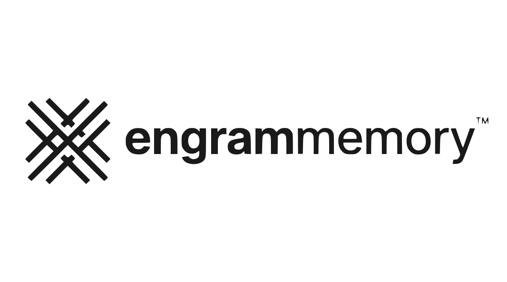

<div align="center">



**Three-Tiered Brain for AI agents. Self-hosted. Zero API costs.**

[Docs](https://engrammemory.ai/docs) · [Quickstart](#quick-start) · [Dashboard](https://app.engrammemory.ai) · [Cloud SDKs](#engram-cloud)


</div>

---

Engram gives your AI agent persistent memory across sessions. Store, search, recall, and forget memories using semantic embeddings — all running on your own hardware. Qdrant, FastEmbed, and the recall engine are bundled into a single Docker container so install is one command.

One repo, two interfaces: an **OpenClaw plugin** that fills OpenClaw's memory slot, and a **universal MCP server** that works with Claude Code, Cursor, Windsurf, VS Code, and any other MCP-compatible client.

---

## What You Get

| Tool | What it does |
|---|---|
| `memory_store` | Save a memory with semantic embedding and auto-classification |
| `memory_search` | Semantic similarity search across all stored memories |
| `memory_recall` | Auto-inject relevant memories into agent context |
| `memory_forget` | Remove memories by ID or search match |
| `memory_consolidate` | Find and merge near-duplicate memories (Janitor) |
| `memory_connect` | Discover cross-category connections between memories (Librarian) |

**Categories:** preference, fact, decision, entity, other — auto-detected from content.

---

## Quick Start

### 1. Deploy the backend

The fastest path — pull the all-in-one container from Docker Hub:

```bash
docker run -d \
  --name engram-memory \
  --restart unless-stopped \
  -p 6333:6333 -p 11435:11435 -p 8585:8585 \
  -v engram_data:/data \
  engrammemory/engram-memory:latest
```

One container bundles **Qdrant** (vector DB), **FastEmbed** (ONNX embeddings, native ARM64 + x86_64), and the **MCP HTTP server** (the recall engine). Memories persist in the `engram_data` volume.

If you've cloned this repo, `bash scripts/setup.sh` does the same thing plus generates an OpenClaw config and a `docker-compose.yml` you can start/stop with `docker compose`. Set `ENGRAM_BUILD_LOCAL=1` to build from local source instead of pulling.

### 2. Connect your agent

**OpenClaw (replaces default memory system):**
```bash
# Clone and install the plugin
git clone https://github.com/EngramMemory/engram-memory-community.git
cd engram-memory-community
bash scripts/install-plugin.sh
```

This installs Engram as a **plugin** (not a skill) and sets it as the memory backend, replacing the built-in SQLite memory with the three-tier recall engine. No API key required — runs fully local against the all-in-one container.

**Claude Code** — native MCP HTTP transport (no Node, no host Python):
```bash
claude mcp add engrammemory --transport http http://localhost:8585/mcp
```

**Cursor, Windsurf, VS Code, Claude Desktop, Cline, Zed, Gemini CLI, Codex, and 7 other clients** — use the universal [`install-mcp`](https://www.npmjs.com/package/install-mcp) helper. It detects your client and writes the right config file for you:
```bash
npx -y install-mcp@latest http://localhost:8585/mcp \
    --client <your-client> --name engrammemory --oauth=no -y
```
Replace `<your-client>` with one of: `claude-code, cursor, windsurf, vscode, claude, cline, roo-cline, zed, gemini-cli, codex, goose, witsy, enconvo, warp, opencode`.

If your client doesn't have a CLI helper, add this to its `.mcp.json` (or equivalent) directly:
```json
{
  "mcpServers": {
    "engrammemory": {
      "type": "http",
      "url": "http://localhost:8585/mcp"
    }
  }
}
```

The container exposes four MCP entry points off the same recall engine — pick whichever your client supports:

| Transport | Endpoint | When to use |
|---|---|---|
| Streamable HTTP | `POST/GET http://localhost:8585/mcp` | Modern MCP clients (Claude Code `--transport http`, etc.) |
| SSE (legacy) | `GET http://localhost:8585/sse` + `POST /messages/` | Older MCP clients that haven't moved to streamable-http |
| Stdio | `docker exec -i engram-memory python /app/mcp_server.py` | When you want a process-per-session model |
| REST | `POST http://localhost:8585/{store,search,recall,forget,consolidate,connect}` | OpenClaw plugin, custom tooling, raw curl |

If you have the repo cloned and Python 3.10+ on the host, you can also run the stdio MCP server directly without going through the container:
```bash
claude mcp add engrammemory -- python mcp/server.py
```

### 3. Use it

```python
# Store a memory
memory_store("User prefers TypeScript over JavaScript", category="preference")

# Search memories
memory_search("language preferences")

# Forget a memory
memory_forget(query="old project requirements")
```

---

## Architecture

```
┌─────────────────┐    ┌─────────────────────────────────────────────────┐
│   Your Agent    │    │       engrammemory/engram-memory (one image)    │
│   (OpenClaw,    │───▶│  ┌──────────────────────────────────────────┐  │
│    Claude Code, │    │  │       Three-Tier Recall Engine           │  │
│    Cursor,      │    │  │  Tier 1: Hot Cache  (sub-ms, ACT-R)      │  │
│    Gemini, ...) │    │  │  Tier 2: Hash Index (O(1) LSH lookup)    │  │
└─────────────────┘    │  │  Tier 3: Qdrant ANN (full hybrid search) │  │
                       │  │  Graph:  Kuzu spreading activation       │  │
                       │  └────────────────┬─────────────────────────┘  │
                       │                   │                            │
                       │   ┌───────────────┴────────────┐               │
                       │   │  FastEmbed ONNX  ─▶ Qdrant │               │
                       │   └────────────────────────────┘               │
                       └─────────────────────────────────────────────────┘
              One container. Persistent /data volume. Nothing leaves your network.
```

### Repo Structure

```
engram-memory-community/
├── plugin/                 ← OpenClaw memory plugin (replaces default memory)
│   ├── index.js                Plugin entry — registers tools + auto-recall/capture
│   ├── openclaw.plugin.json    Plugin manifest (kind: "memory")
│   └── package.json
├── plugin.py               ← Python entry point for OpenClaw tool calls
├── src/
│   └── recall/             ← Three-tier recall engine + graph layer
│       ├── recall_engine.py    Hot → Hash → Vector pipeline + graph expansion
│       ├── hot_tier.py         ACT-R activation cache (sub-ms)
│       ├── multi_head_hasher.py  LSH O(1) candidate retrieval
│       ├── matryoshka.py       Vector slicing (768 → 256 → 64 dim)
│       ├── consolidation.py    Janitor (dedup) + Librarian (cross-linking)
│       ├── graph_layer.py      Kuzu graph for entity tracking
│       └── models.py           MemoryResult, EngramConfig
├── mcp/
│   └── server.py           ← Stdio MCP server (Claude Code, Cursor, Windsurf, VS Code)
├── docker/
│   ├── all-in-one/         ← Single-container image (Qdrant + FastEmbed + MCP)
│   │   ├── Dockerfile         Multi-stage build with s6-overlay supervisor
│   │   ├── init.sh            Bootstraps the agent-memory collection on first run
│   │   └── services.d/        s6 service definitions for each bundled process
│   ├── fastembed/          ← FastEmbed standalone container (used by all-in-one)
│   └── mcp/                ← Dockerized HTTP MCP server (entrypoint.py + Dockerfile)
├── scripts/
│   ├── setup.sh                Installs the all-in-one container + writes compose file
│   ├── install-plugin.sh       Installs the OpenClaw plugin
│   └── ...                     Fallback memory_store / memory_search scripts
├── config/
│   └── docker-compose.yml
├── context/                ← Context system (separate from memory; see SKILL.md)
├── bin/                    ← CLI tools: engram-context, engram-ask, engram-semantic
├── docs/                   ← Architecture, integration guides, SOUL rules
├── README.md
└── LICENSE
```

The OpenClaw plugin routes through `plugin.py`, which uses the three-tier recall engine. The stdio MCP server (`mcp/server.py`) and the dockerized HTTP MCP server (`docker/mcp/entrypoint.py`) both wrap the same `EngramRecallEngine` from `src/recall/`.

---

## OpenClaw Integration

Engram hooks into OpenClaw's agent lifecycle automatically:

- **`before_agent_start`** — searches for memories relevant to the user's message and injects them as context
- **`after_agent_response`** — extracts important facts from the conversation and stores them

```json
{
  "plugins": {
    "entries": {
      "engram": {
        "enabled": true,
        "config": {
          "qdrantUrl": "http://localhost:6333",
          "embeddingUrl": "http://localhost:11435",
          "autoRecall": true,
          "autoCapture": true
        }
      }
    }
  }
}
```

---

## Configuration

| Option | Default | Description |
|---|---|---|
| `qdrantUrl` | `http://localhost:6333` | Qdrant vector database URL |
| `embeddingUrl` | `http://localhost:11435` | FastEmbed API endpoint |
| `embeddingModel` | `nomic-ai/nomic-embed-text-v1.5` | Embedding model |
| `collection` | `agent-memory` | Memory collection name |
| `autoRecall` | `true` | Auto-inject relevant memories |
| `autoCapture` | `true` | Auto-save important context |
| `maxRecallResults` | `5` | Max memories per auto-recall |
| `minRecallScore` | `0.35` | Minimum similarity threshold |
| `debug` | `false` | Enable debug logging |

---

## Connecting to Engram Cloud (Optional)

Engram runs fully local by default. When you need overflow storage, TurboQuant compression, deduplication, or analytics beyond what your local machine can handle, connect to [Engram Cloud](https://engrammemory.ai):

1. **Get an API key** at [app.engrammemory.ai](https://app.engrammemory.ai) (free tier, no credit card)
2. **Add it to your OpenClaw config:**
   ```bash
   openclaw config set "plugins.entries.engram.config.apiKey" "eng_live_YOUR_KEY"
   ```
3. **Restart OpenClaw** — the plugin automatically switches from local to cloud mode

With a key, your memories still live in your Qdrant. Engram Cloud handles embedding, deduplication, and compression in transit — nothing is stored on our servers.

---

## Requirements

- Docker (the all-in-one container is the only required runtime)
- 4 GB+ RAM
- 10 GB+ storage for the persistent volume

Optional, only if you want to run the stdio MCP server, the OpenClaw plugin in fallback mode, or the `engram-context` / `engram-ask` CLI tools directly on the host:

- Python 3.10+

---

## Data & Privacy

Engram is local-only. No data leaves your machine.

- **Memory tools** store and search vectors in the Qdrant instance bundled inside the container
- **Embeddings** are generated by FastEmbed (ONNX, native ARM64 + x86_64) running in the same container
- **Context system** only reads `.md` files inside your project's `.context/` directory — never arbitrary project files
- **Auto-recall/auto-capture** (when enabled) operate within the OpenClaw agent lifecycle — memories stay in your local Qdrant
- **No telemetry, no phone-home, no external API calls**

The Docker image `engrammemory/engram-memory` is built from `docker/all-in-one/Dockerfile` in this repo. You can verify or rebuild it yourself with `docker build -f docker/all-in-one/Dockerfile -t engrammemory/engram-memory:local .`.

---

## Engram Cloud

Need deduplication, compression, lifecycle management, multi-agent isolation, or analytics? [Engram Cloud](https://engrammemory.ai) adds enterprise intelligence on top of your self-hosted storage.

Your Memory stays yours. Engram Cloud processes in transit and stores nothing.

**SDKs:**
- Python: `pip install engrammemory-ai` — [PyPI](https://pypi.org/project/engrammemory-ai/)
- Node: `npm install engrammemory-ai` — [npm](https://www.npmjs.com/package/engrammemory-ai)
- [Dashboard](https://app.engrammemory.ai) | [API Docs](https://api.engrammemory.ai/docs)

---

## Contributing

Found a bug? Want to add a feature? PRs welcome.

---

## License

MIT — Use freely in personal and commercial projects.
