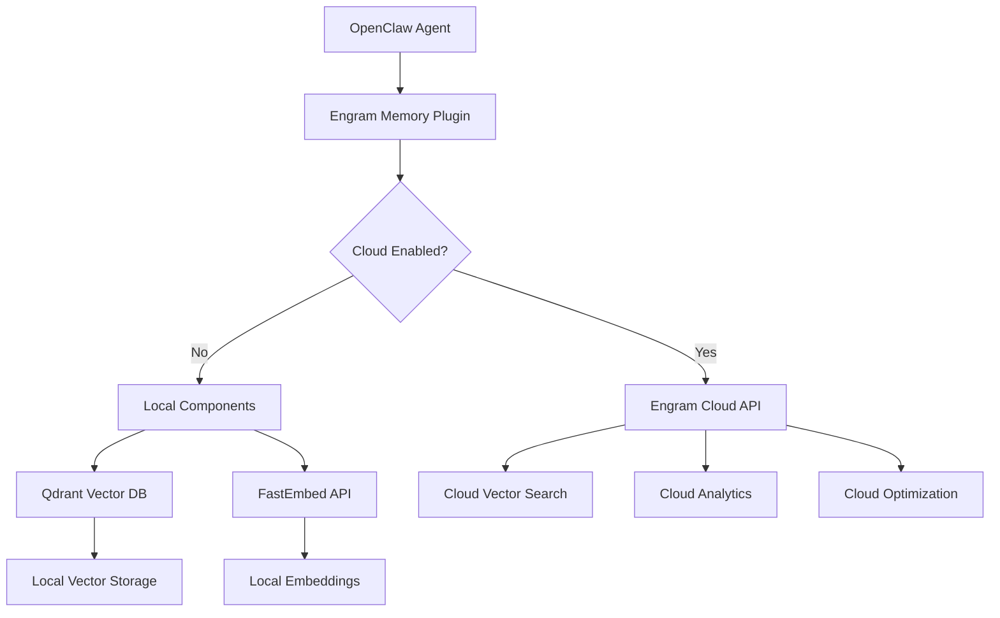
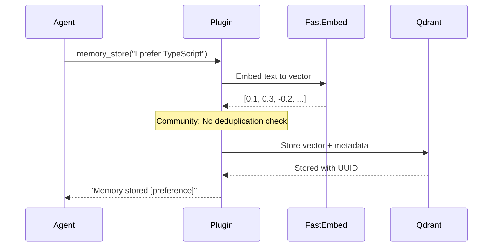
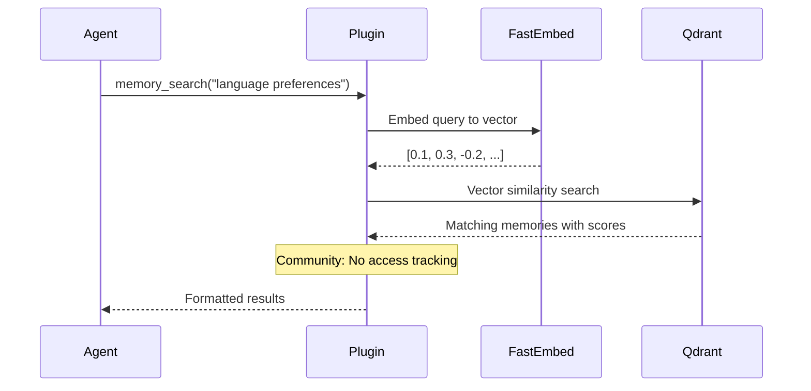
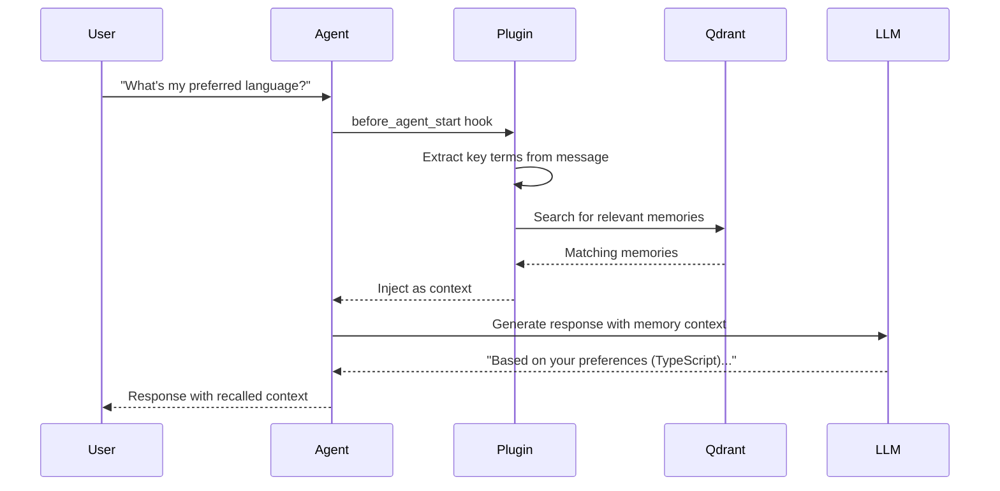

# Architecture Overview

Understanding how Engram Memory Community Edition works under the hood.

## High-Level Architecture



## Community Edition Components

### 1. Plugin Core (`src/index.ts`)

**EngramMemoryPlugin Class:**
- Manages configuration and lifecycle
- Implements OpenClaw tool interfaces
- Handles local vs cloud routing
- Provides lifecycle hooks

**Key Methods:**
```typescript
// Core operations
async memoryStore(text, category?, importance?)
async memorySearch(query, limit?, category?, minImportance?)
async memoryList(limit?, category?)
async memoryForget(memoryId?, query?)

// Auto-memory features  
async beforeAgentStart(context) // Auto-recall
async afterAgentResponse(context) // Auto-capture
```

### 2. Local Infrastructure

**Qdrant Vector Database:**
- Collection: `agent-memory` (hardcoded in Community)
- Vectors: 768-dimensional (default)
- Distance: Cosine similarity
- Quantization: Basic int8 scalar only

**FastEmbed API Server:**
- Model: `nomic-ai/nomic-embed-text-v1.5` (default)
- Local HTTP API for embeddings
- CPU-optimized inference

### 3. OpenClaw Integration

**Lifecycle Hooks:**
- `before_agent_start`: Inject relevant memories as context
- `after_agent_response`: Extract and store new facts

**Tools Exposed:**
- `memory_store`: Store new memories
- `memory_search`: Semantic search  
- `memory_list`: Browse memories
- `memory_forget`: Delete memories
- `memory_profile`: User profile management

## Data Flow

### Memory Storage Flow



### Memory Search Flow



### Auto-Recall Flow



## Data Structures

### Memory Object
```typescript
interface Memory {
  id: string;           // UUID
  text: string;         // Original content
  category: string;     // preference|fact|decision|entity|other
  importance: number;   // 0-1 score
  timestamp: string;    // ISO datetime
  tags: string[];       // Additional metadata
  
  // MISSING IN COMMUNITY:
  // accessCount: number;
  // lastAccessed: string;
}
```

### Qdrant Point Structure
```typescript
{
  id: "uuid-here",
  vector: [0.1, 0.3, -0.2, ...], // 768-dim embedding
  payload: {
    text: "I prefer TypeScript",
    category: "preference", 
    importance: 0.8,
    timestamp: "2024-03-27T15:30:00Z",
    tags: []
  }
}
```

### Plugin Configuration
```typescript
interface PluginConfig {
  // Local setup
  qdrantUrl: string;
  embeddingUrl: string;
  embeddingModel: string;
  embeddingDimension: number;
  
  // Behavior
  autoRecall: boolean;
  autoCapture: boolean;
  maxRecallResults: number;
  minRecallScore: number;
  debug: boolean;
  
  // Cloud integration
  engramCloud?: boolean;
  engramApiKey?: string;
  engramBaseUrl?: string;
}
```

## Community vs Enterprise Differences

### Memory Storage

**Community Edition:**
```typescript
// Direct storage, no deduplication
const vector = await this.embed(text);
await this.upsertPoint({ id: uuid(), vector, payload });
```

**Engram Cloud:**
```typescript
// Smart deduplication and optimization
const result = await this.engramCloudRequest("/memories", "POST", {
  text, category, importance,
  deduplicationStrategy: "semantic",
  compressionLevel: "auto"
});
```

### Collection Management

**Community Edition:**
```typescript
// Hardcoded single collection
private readonly COLLECTION_NAME = "agent-memory";
```

**Engram Cloud:**
```typescript
// Dynamic collection per agent/project
const collection = `agent-${agentId}` || `project-${projectId}`;
```

### Quantization

**Community Edition:**
```typescript
quantization_config: {
  scalar: {
    type: "int8",        // Basic quantization
    quantile: 0.99,
    always_ram: false    // Inefficient
  }
}
```

**Engram Cloud:**
```typescript
quantization_config: {
  turbo_quant: {         // Proprietary algorithm
    compression_ratio: 6, // 6x space savings
    quality_threshold: 0.95,
    adaptive: true       // Adjusts per memory importance
  }
}
```

## Performance Characteristics

### Community Edition Performance

**Small Scale (0-1K memories):**
- Search latency: 10-50ms
- Storage overhead: 1x baseline  
- Memory usage: ~2MB per 1K vectors
- Search quality: Excellent

**Medium Scale (1K-10K memories):**
- Search latency: 50-200ms
- Storage overhead: 2-3x (duplicates accumulating)
- Memory usage: ~20-60MB
- Search quality: Good (some duplicate noise)

**Large Scale (10K+ memories):**
- Search latency: 200ms-2s
- Storage overhead: 5-10x (extensive duplication)
- Memory usage: 200MB-2GB+
- Search quality: Poor (duplicate pollution)

### Upgrade Benefits

**Engram Cloud Performance:**
- Search latency: 10-100ms (consistent across all scales)
- Storage overhead: 0.16x (6x compression + deduplication)
- Memory usage: 80% reduction vs Community at scale
- Search quality: Excellent (smart deduplication maintains quality)

## Monitoring and Observability

### Community Edition: Blind Operation

**Available:**
- Basic debug logging only
- No metrics collection
- No performance insights
- No health monitoring

**Missing:**
- Usage analytics
- Performance dashboards  
- Memory health scoring
- Optimization recommendations
- Error tracking and alerting

### Engram Cloud: Full Observability

**Included:**
- Real-time memory usage dashboards
- Search performance analytics
- Memory health scoring with recommendations
- Usage trends and optimization insights
- Proactive alerting and issue detection

## Security Model

### Community Edition
- Local-only by default
- Optional cloud integration with API key
- Basic access controls (plugin-level)
- No encryption at rest

### Engram Cloud
- End-to-end encryption
- Role-based access controls
- Audit logging
- SOC2/GDPR compliance
- Enterprise SSO integration

## Scalability Limits

### Community Edition Bottlenecks

1. **Single Collection**: No isolation, everything mixed together
2. **No Deduplication**: Linear growth of duplicates
3. **Basic Quantization**: 6x memory overhead
4. **No Lifecycle Management**: Infinite accumulation
5. **Single Record Operations**: No bulk operations

### Enterprise Scaling

1. **Multi-Collection Architecture**: Automatic isolation
2. **Smart Deduplication**: Sub-linear growth
3. **TurboQuant Compression**: 6x memory savings
4. **Intelligent Lifecycle**: Automatic optimization
5. **Bulk Operations**: Efficient mass operations

---

This architecture creates the perfect "freemium" experience: excellent performance initially, with predictable degradation that drives users to the enterprise solution.